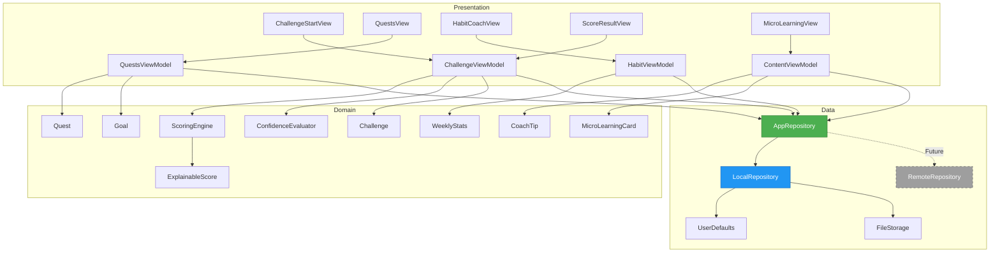

# Haushalts-Hero – Frontend-only MVP Scope

**Version:** 1.0
**Datum:** 2025-11-18
**Status:** Phase 0 – Architektur & Setup

---

## 1. Übersicht

### Projektziel
Entwicklung einer **rein lokalen iOS-App** (SwiftUI) für den Haushalts-Hero mit vollständigem Challenge-Flow, erklärbarem Scoring, lokalen Quests/Goals, Coaching-Views und Privacy-Screen. Alle Daten werden ausschließlich lokal gehalten; Backend-Integration ist über ein Repository-Interface später nachrüstbar.

### Technologie-Stack
- **Plattform:** iOS (ab iOS 16.0)
- **Framework:** SwiftUI
- **Architektur:** MVVM (Model-View-ViewModel)
- **On-Device:** Kamera, Vision Framework, Core ML (optional)
- **Persistenz:** UserDefaults + lokales File-basiertes Storage
- **Keine Netzwerk-Abhängigkeiten** in MVP FE-1/2/3

---

## 2. MVP-Definitionen

### MVP FE-1: "Explainable Score Demo"
**Ziel:** Vollständiger Challenge-Flow mit erklärbarem Scoring
**Features:**
- Challenge starten → Vorher-/Nachher-Fotos aufnehmen → Score-Ergebnis anzeigen
- Explainable Score mit Subscores (Detailgrad, Streifenfreiheit, Gleichmäßigkeit)
- Erklärtext-Generierung (Template-basiert)
- Heatmap-Overlay zur Visualisierung
- Confidence-Anzeige mit Re-Try-Option
- Privacy-Screen v0 (erklärt lokale Datenverarbeitung)

**Erfolg:** Funktioniert vollständig offline, Score ist nachvollziehbar

---

### MVP FE-2: "Local Hero" (Gamification)
**Ziel:** Lokale Quest-/Goal-Mechanik und Coaching
**Features:**
- Wochenstatistik (lokal gespeichert)
- Lokale Quests (z.B. "3x Spiegel putzen")
- Haushalts-Goal mit Fortschrittsbalken
- Season-Banner (zeitbasiert, JSON-gesteuert)
- Habit-Coach-View mit Wochenzielen

**Erfolg:** Nutzer:innen können Fortschritte sehen, Ziele setzen und verfolgen

---

### MVP FE-3: "Pro Preview"
**Ziel:** Vorschau auf zukünftige Pro-Features
**Features:**
- Lokaler Monatsreport (Statistiken aus lokalen Daten)
- UI-Toggles für kommende Features (Cloud-Sync, Leaderboard, Pro-Account)
- Klare "Coming Soon"-Markierung

**Erfolg:** Nutzer:innen verstehen Feature-Roadmap ohne falsche Erwartungen

---

## 3. Functional Requirements (Frontend-only)

| ID | Beschreibung | MVP | Priorität |
|----|--------------|-----|-----------|
| **FR-FE-1** | Kompletter Challenge-Flow (Start → Foto → Score) lokal | FE-1 | MUST |
| **FR-FE-2** | Subscores anzeigen (min. 3 Dimensionen) | FE-1 | MUST |
| **FR-FE-3** | Erklärtext zum Score generieren | FE-1 | MUST |
| **FR-FE-4** | Heatmap-Overlay über Nachher-Foto | FE-1 | SHOULD |
| **FR-FE-5** | Confidence-Wert berechnen & anzeigen | FE-1 | MUST |
| **FR-FE-6** | Re-Try Flow bei Low Confidence | FE-1 | MUST |
| **FR-FE-7** | Lokale Wochenstatistik speichern/abrufen | FE-2 | MUST |
| **FR-FE-8** | Lokale Quests definieren & tracken | FE-2 | MUST |
| **FR-FE-9** | Lokale Haushalts-Goals mit Progress | FE-2 | MUST |
| **FR-FE-10** | Season-Banner (zeitbasiert, JSON) | FE-2 | SHOULD |
| **FR-FE-11** | Coaching-Tipps nach Challenge (kontext-basiert) | FE-2 | MUST |
| **FR-FE-12** | Habit-Coach mit Wochenzielen | FE-2 | SHOULD |
| **FR-FE-13** | Micro-Learning-Kacheln browsebar | FE-2 | SHOULD |
| **FR-FE-14** | Privacy-Screen (erklärt lokale Verarbeitung) | FE-1 | MUST |
| **FR-FE-15** | UI für zukünftige Features (Toggles/Previews) | FE-3 | SHOULD |
| **FR-FE-16** | Pro Preview: Lokaler Monatsreport | FE-3 | SHOULD |
| **FR-FE-17** | Repository-Architektur backend-ready | FE-1 | MUST |

---

## 4. Non-Functional Requirements

| ID | Beschreibung | Zielwert |
|----|--------------|----------|
| **NFR-FE-1** | Offline-Fähigkeit | 100% (kein Netzwerk erforderlich) |
| **NFR-FE-2** | Lokale Persistenz | Daten bleiben nach App-Neustart erhalten |
| **NFR-FE-3** | Backend-ready-Architektur | AppRepository-Interface ermöglicht spätere Remote-Implementierung |
| **NFR-FE-4** | Performance | Scoring-Latenz < 2s (p95), Heatmap-Rendering < 500ms |
| **NFR-FE-5** | Crash-Freiheit | 0% Crashes in TestFlight-Tests (n ≥ 50) |

---

## 5. Success Criteria

| ID | Kriterium | Messgröße |
|----|-----------|-----------|
| **SC-FE-1** | Challenge-Flow verständlich | ≥ 80% Nutzer:innen schließen ersten Flow ab (Usability-Test) |
| **SC-FE-2** | Nutzung von Quests/Habit-Coach | ≥ 50% interagieren mit Quest-Screen in Woche 1 |
| **SC-FE-3** | Verständnis Score-Erklärung | ≥ 70% können Subscores erklären (Interview nach Test) |
| **SC-FE-4** | Backend-Integration möglich | Entwickler:innen können Remote-Repository in < 1 Tag integrieren |

---

## 6. Architektur-Übersicht

### 6.1 Layer-Struktur

```
┌─────────────────────────────────────────────────────────┐
│                   Presentation Layer                    │
│  (SwiftUI Views + ViewModels)                           │
│  - ChallengeStartView, CameraFlowView, ScoreResultView  │
│  - QuestsView, HabitCoachView, MicroLearningView        │
│  - ViewModels: ChallengeViewModel, QuestsViewModel, ... │
└─────────────────────────────────────────────────────────┘
                          │
                          ▼
┌─────────────────────────────────────────────────────────┐
│                    Domain Layer                         │
│  (Business Logic & Models)                              │
│  - Challenge, Score, Subscore, ExplainableScore         │
│  - Quest, Goal, Season, WeeklyStats                     │
│  - CoachTip, MicroLearningCard                          │
│  - ScoringEngine, CoachingEngine, ConfidenceEvaluator   │
└─────────────────────────────────────────────────────────┘
                          │
                          ▼
┌─────────────────────────────────────────────────────────┐
│                     Data Layer                          │
│  (Repository Pattern)                                   │
│                                                         │
│  ┌─────────────────────────────────┐                   │
│  │   AppRepository (Protocol)      │                   │
│  │   - Defines all data operations │                   │
│  │   - Backend-agnostic interface  │                   │
│  └─────────────────────────────────┘                   │
│              │                   │                      │
│              ▼                   ▼                      │
│  ┌──────────────────┐  ┌──────────────────┐            │
│  │ LocalRepository  │  │ RemoteRepository │            │
│  │ (UserDefaults +  │  │  (Future: API)   │            │
│  │  File Storage)   │  │                  │            │
│  └──────────────────┘  └──────────────────┘            │
└─────────────────────────────────────────────────────────┘
```

### 6.2 Architektur-Diagramm (Mermaid)



### 6.3 Daten-Modelle (Domain Layer)

#### Core Models
```swift
struct Challenge {
    let id: UUID
    let category: ChallengeCategory
    let beforePhoto: UIImage
    let afterPhoto: UIImage
    let timestamp: Date
    let score: ExplainableScore?
}

struct ExplainableScore {
    let overallScore: Int        // 0-100
    let subscores: [Subscore]    // z.B. Detailgrad, Streifenfreiheit, etc.
    let confidence: Double       // 0.0-1.0
    let explanation: String      // Generierter Erklärtext
}

struct Subscore {
    let name: String            // "Detailgrad", "Streifenfreiheit"
    let value: Int              // 0-100
    let weight: Double          // 0.0-1.0
}

enum ChallengeCategory: String, CaseIterable {
    case mirror = "Spiegel"
    case toilet = "Toilette"
    case room = "Zimmer"
}
```

#### Gamification Models
```swift
struct Quest {
    let id: UUID
    let title: String
    let description: String
    let targetCount: Int
    let currentProgress: Int
    let category: ChallengeCategory?
    let weekStart: Date
}

struct Goal {
    let id: UUID
    let title: String
    let targetPoints: Int
    let currentPoints: Int
    let weekStart: Date
}

struct WeeklyStats {
    let weekStart: Date
    let challengesCompleted: Int
    let averageScore: Double
    let categoryCounts: [ChallengeCategory: Int]
}
```

#### Content Models
```swift
struct CoachTip {
    let id: UUID
    let title: String
    let content: String
    let triggerRules: [TriggerRule]  // z.B. "if subscore.streaks < 50"
    let category: ChallengeCategory?
}

struct MicroLearningCard {
    let id: UUID
    let title: String
    let content: String
    let imageURL: String?
    let category: ChallengeCategory
}

struct Season {
    let id: UUID
    let title: String
    let description: String
    let startDate: Date
    let endDate: Date
    let theme: String
}
```

### 6.4 Repository-Interface (Data Layer)

```swift
protocol AppRepository {
    // Challenge Operations
    func saveChallengeHistory(_ challenge: Challenge) async throws
    func getChallengeHistory(limit: Int?) async throws -> [Challenge]
    func getChallengesForWeek(startDate: Date) async throws -> [Challenge]

    // Quests & Goals
    func getActiveQuests() async throws -> [Quest]
    func updateQuestProgress(questId: UUID, newProgress: Int) async throws
    func getActiveGoal() async throws -> Goal?
    func updateGoalProgress(points: Int) async throws

    // Stats
    func getWeeklyStats(weekStart: Date) async throws -> WeeklyStats
    func updateWeeklyStats(stats: WeeklyStats) async throws

    // Content
    func getCoachingTips(for score: ExplainableScore) async throws -> [CoachTip]
    func getMicroLearningCards(category: ChallengeCategory?) async throws -> [MicroLearningCard]
    func getActiveSeason() async throws -> Season?

    // Settings
    func saveUserSettings(_ settings: UserSettings) async throws
    func getUserSettings() async throws -> UserSettings
}
```

---

## 7. Scope-Abgrenzung

### ✅ In Scope (Frontend-MVP)
- Vollständiger Challenge-Flow (Kamera → Scoring → Ergebnis)
- Lokale Persistenz aller Daten
- On-Device Scoring (Vision/CoreML oder heuristische Simulation)
- Quest-/Goal-Tracking (lokal, gerätespezifisch)
- Coaching-Content (statisches JSON, lokal)
- Privacy-Screen (erklärt Offline-Ansatz)

### ❌ Out of Scope (Backend/Future)
- Netzwerkkommunikation mit Backend
- Echte User-Accounts & Cloud-Sync
- Haushalts-übergreifende Leaderboards
- Push-Notifications
- Server-seitiges Scoring
- Deployment auf Cloud-Infrastruktur
- Production-Monitoring & Analytics

---

## 8. Risiken & Mitigations

| Risiko | Wahrscheinlichkeit | Impact | Mitigation |
|--------|-------------------|--------|------------|
| **Backend-Mismatch bei späterer Integration** | Mittel | Hoch | AppRepository-Interface bewusst backend-agnostisch designen (T4.3-FE) |
| **Over-Engineering im Frontend** | Mittel | Mittel | Minimal-Ansatz: Nur Features implementieren, die wirklich genutzt werden |
| **Unrealistische Nutzer-Erwartungen bei "Coming Soon"-Features** | Hoch | Mittel | Sehr klare Kennzeichnung, keine toten Enden, Roadmap transparent machen |
| **On-Device-Scoring zu ungenau** | Mittel | Hoch | Im MVP akzeptabel; ggf. heuristische Simulation statt echtes Vision/ML |
| **Lokale Daten-Inkonsistenz** | Niedrig | Mittel | Versionierung des Storage-Formats, Migrations-Strategie dokumentieren |

---

## 9. Erfolgs-Definition

**Phase 0 abgeschlossen, wenn:**
- ✅ Dieses Dokument existiert und vom Team freigegeben ist
- ✅ Architektur-Skizze (Mermaid) ist klar und nachvollziehbar
- ✅ AppRepository-Interface ist definiert
- ✅ LocalRepository hat eine erste lauffähige Implementierung mit Dummy-Daten

**MVP FE-1 abgeschlossen, wenn:**
- ✅ Challenge-Flow funktioniert vollständig offline
- ✅ Score ist erklärbar (Subscores + Text)
- ✅ Privacy-Screen existiert
- ✅ 0 Crashes in internen Tests (n ≥ 20)

**MVP FE-2 abgeschlossen, wenn:**
- ✅ Quests & Goals funktionieren lokal
- ✅ Wochenstatistik ist persistent
- ✅ Coaching-Tipps werden kontextbasiert angezeigt

**MVP FE-3 abgeschlossen, wenn:**
- ✅ Pro-Preview zeigt sinnvolle Daten
- ✅ "Coming Soon"-Features sind klar markiert
- ✅ Backend-Integration ist in < 1 Tag machbar (prototypisch validiert)

---

## 10. Nächste Schritte

1. **T0.2-FE:** AppRepository-Protokoll + LocalRepository implementieren
2. **Phase 1:** Challenge-Flow-UI bauen (T1.1-FE)
3. **Iteratives Vorgehen:** Nach jedem MVP Usability-Test durchführen und learnings einfließen lassen

---

**Erstellt von:** AI Agent
**Review durch:** Team (anstehend)
**Nächste Review:** Nach T0.2-FE (LocalRepository fertig)
