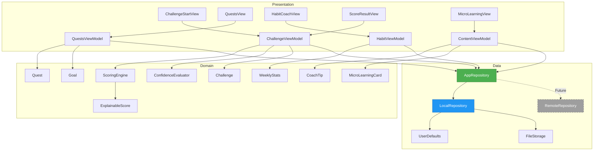

# Haushalts-Hero – Frontend-only MVP Scope

**Version:** 1.0
**Datum:** 2025-11-18
**Status:** Phase 0 – Architektur & Setup

---

## 1. Übersicht

### Projektziel
Entwicklung einer **rein lokalen iOS-App** (SwiftUI) für den Haushalts-Hero mit vollständigem Challenge-Flow, erklärbarem Scoring, lokalen Quests/Goals, Coaching-Views und Privacy-Screen. Alle Daten werden ausschließlich lokal gehalten; Backend-Integration ist über ein Repository-Interface später nachrüstbar.

### Technologie-Stack
- **Plattform:** iOS (ab iOS 16.0)
- **Framework:** SwiftUI
- **Architektur:** MVVM (Model-View-ViewModel)
- **On-Device:** Kamera, Vision Framework, Core ML (optional)
- **Persistenz:** UserDefaults + lokales File-basiertes Storage
- **Keine Netzwerk-Abhängigkeiten** in MVP FE-1/2/3

---

## 2. MVP-Definitionen

### MVP FE-1: "Explainable Score Demo"
**Ziel:** Vollständiger Challenge-Flow mit erklärbarem Scoring
**Features:**
- Challenge starten → Vorher-/Nachher-Fotos aufnehmen → Score-Ergebnis anzeigen
- Explainable Score mit Subscores (Detailgrad, Streifenfreiheit, Gleichmäßigkeit)
- Erklärtext-Generierung (Template-basiert)
- Heatmap-Overlay zur Visualisierung
- Confidence-Anzeige mit Re-Try-Option
- Privacy-Screen v0 (erklärt lokale Datenverarbeitung)

**Erfolg:** Funktioniert vollständig offline, Score ist nachvollziehbar

---

### MVP FE-2: "Local Hero" (Gamification)
**Ziel:** Lokale Quest-/Goal-Mechanik und Coaching
**Features:**
- Wochenstatistik (lokal gespeichert)
- Lokale Quests (z.B. "3x Spiegel putzen")
- Haushalts-Goal mit Fortschrittsbalken
- Season-Banner (zeitbasiert, JSON-gesteuert)
- Habit-Coach-View mit Wochenzielen

**Erfolg:** Nutzer:innen können Fortschritte sehen, Ziele setzen und verfolgen

---

### MVP FE-3: "Pro Preview"
**Ziel:** Vorschau auf zukünftige Pro-Features
**Features:**
- Lokaler Monatsreport (Statistiken aus lokalen Daten)
- UI-Toggles für kommende Features (Cloud-Sync, Leaderboard, Pro-Account)
- Klare "Coming Soon"-Markierung

**Erfolg:** Nutzer:innen verstehen Feature-Roadmap ohne falsche Erwartungen

---

## 3. Functional Requirements (Frontend-only)

| ID | Beschreibung | MVP | Priorität |
|----|--------------|-----|-----------|
| **FR-FE-1** | Kompletter Challenge-Flow (Start → Foto → Score) lokal | FE-1 | MUST |
| **FR-FE-2** | Subscores anzeigen (min. 3 Dimensionen) | FE-1 | MUST |
| **FR-FE-3** | Erklärtext zum Score generieren | FE-1 | MUST |
| **FR-FE-4** | Heatmap-Overlay über Nachher-Foto | FE-1 | SHOULD |
| **FR-FE-5** | Confidence-Wert berechnen & anzeigen | FE-1 | MUST |
| **FR-FE-6** | Re-Try Flow bei Low Confidence | FE-1 | MUST |
| **FR-FE-7** | Lokale Wochenstatistik speichern/abrufen | FE-2 | MUST |
| **FR-FE-8** | Lokale Quests definieren & tracken | FE-2 | MUST |
| **FR-FE-9** | Lokale Haushalts-Goals mit Progress | FE-2 | MUST |
| **FR-FE-10** | Season-Banner (zeitbasiert, JSON) | FE-2 | SHOULD |
| **FR-FE-11** | Coaching-Tipps nach Challenge (kontext-basiert) | FE-2 | MUST |
| **FR-FE-12** | Habit-Coach mit Wochenzielen | FE-2 | SHOULD |
| **FR-FE-13** | Micro-Learning-Kacheln browsebar | FE-2 | SHOULD |
| **FR-FE-14** | Privacy-Screen (erklärt lokale Verarbeitung) | FE-1 | MUST |
| **FR-FE-15** | UI für zukünftige Features (Toggles/Previews) | FE-3 | SHOULD |
| **FR-FE-16** | Pro Preview: Lokaler Monatsreport | FE-3 | SHOULD |
| **FR-FE-17** | Repository-Architektur backend-ready | FE-1 | MUST |

---

## 4. Non-Functional Requirements

| ID | Beschreibung | Zielwert |
|----|--------------|----------|
| **NFR-FE-1** | Offline-Fähigkeit | 100% (kein Netzwerk erforderlich) |
| **NFR-FE-2** | Lokale Persistenz | Daten bleiben nach App-Neustart erhalten |
| **NFR-FE-3** | Backend-ready-Architektur | AppRepository-Interface ermöglicht spätere Remote-Implementierung |
| **NFR-FE-4** | Performance | Scoring-Latenz < 2s (p95), Heatmap-Rendering < 500ms |
| **NFR-FE-5** | Crash-Freiheit | 0% Crashes in TestFlight-Tests (n ≥ 50) |

---

## 5. Success Criteria

| ID | Kriterium | Messgröße |
|----|-----------|-----------|
| **SC-FE-1** | Challenge-Flow verständlich | ≥ 80% Nutzer:innen schließen ersten Flow ab (Usability-Test) |
| **SC-FE-2** | Nutzung von Quests/Habit-Coach | ≥ 50% interagieren mit Quest-Screen in Woche 1 |
| **SC-FE-3** | Verständnis Score-Erklärung | ≥ 70% können Subscores erklären (Interview nach Test) |
| **SC-FE-4** | Backend-Integration möglich | Entwickler:innen können Remote-Repository in < 1 Tag integrieren |

---

## 6. Architektur-Übersicht

### 6.1 Layer-Struktur

```
┌─────────────────────────────────────────────────────────┐
│                   Presentation Layer                    │
│  (SwiftUI Views + ViewModels)                           │
│  - ChallengeStartView, CameraFlowView, ScoreResultView  │
│  - QuestsView, HabitCoachView, MicroLearningView        │
│  - ViewModels: ChallengeViewModel, QuestsViewModel, ... │
└─────────────────────────────────────────────────────────┘
                          │
                          ▼
┌─────────────────────────────────────────────────────────┐
│                    Domain Layer                         │
│  (Business Logic & Models)                              │
│  - Challenge, Score, Subscore, ExplainableScore         │
│  - Quest, Goal, Season, WeeklyStats                     │
│  - CoachTip, MicroLearningCard                          │
│  - ScoringEngine, CoachingEngine, ConfidenceEvaluator   │
└─────────────────────────────────────────────────────────┘
                          │
                          ▼
┌─────────────────────────────────────────────────────────┐
│                     Data Layer                          │
│  (Repository Pattern)                                   │
│                                                         │
│  ┌─────────────────────────────────┐                   │
│  │   AppRepository (Protocol)      │                   │
│  │   - Defines all data operations │                   │
│  │   - Backend-agnostic interface  │                   │
│  └─────────────────────────────────┘                   │
│              │                   │                      │
│              ▼                   ▼                      │
│  ┌──────────────────┐  ┌──────────────────┐            │
│  │ LocalRepository  │  │ RemoteRepository │            │
│  │ (UserDefaults +  │  │  (Future: API)   │            │
│  │  File Storage)   │  │                  │            │
│  └──────────────────┘  └──────────────────┘            │
└─────────────────────────────────────────────────────────┘
```

### 6.2 Architektur-Diagramm (Mermaid)



### 6.3 Daten-Modelle (Domain Layer)

#### Core Models
```swift
struct Challenge {
    let id: UUID
    let category: ChallengeCategory
    let beforePhoto: UIImage
    let afterPhoto: UIImage
    let timestamp: Date
    let score: ExplainableScore?
}

struct ExplainableScore {
    let overallScore: Int        // 0-100
    let subscores: [Subscore]    // z.B. Detailgrad, Streifenfreiheit, etc.
    let confidence: Double       // 0.0-1.0
    let explanation: String      // Generierter Erklärtext
}

struct Subscore {
    let name: String            // "Detailgrad", "Streifenfreiheit"
    let value: Int              // 0-100
    let weight: Double          // 0.0-1.0
}

enum ChallengeCategory: String, CaseIterable {
    case mirror = "Spiegel"
    case toilet = "Toilette"
    case room = "Zimmer"
}
```

#### Gamification Models
```swift
struct Quest {
    let id: UUID
    let title: String
    let description: String
    let targetCount: Int
    let currentProgress: Int
    let category: ChallengeCategory?
    let weekStart: Date
}

struct Goal {
    let id: UUID
    let title: String
    let targetPoints: Int
    let currentPoints: Int
    let weekStart: Date
}

struct WeeklyStats {
    let weekStart: Date
    let challengesCompleted: Int
    let averageScore: Double
    let categoryCounts: [ChallengeCategory: Int]
}
```

#### Content Models
```swift
struct CoachTip {
    let id: UUID
    let title: String
    let content: String
    let triggerRules: [TriggerRule]  // z.B. "if subscore.streaks < 50"
    let category: ChallengeCategory?
}

struct MicroLearningCard {
    let id: UUID
    let title: String
    let content: String
    let imageURL: String?
    let category: ChallengeCategory
}

struct Season {
    let id: UUID
    let title: String
    let description: String
    let startDate: Date
    let endDate: Date
    let theme: String
}
```

### 6.4 Repository-Interface (Data Layer)

```swift
protocol AppRepository {
    // Challenge Operations
    func saveChallengeHistory(_ challenge: Challenge) async throws
    func getChallengeHistory(limit: Int?) async throws -> [Challenge]
    func getChallengesForWeek(startDate: Date) async throws -> [Challenge]

    // Quests & Goals
    func getActiveQuests() async throws -> [Quest]
    func updateQuestProgress(questId: UUID, newProgress: Int) async throws
    func getActiveGoal() async throws -> Goal?
    func updateGoalProgress(points: Int) async throws

    // Stats
    func getWeeklyStats(weekStart: Date) async throws -> WeeklyStats
    func updateWeeklyStats(stats: WeeklyStats) async throws

    // Content
    func getCoachingTips(for score: ExplainableScore) async throws -> [CoachTip]
    func getMicroLearningCards(category: ChallengeCategory?) async throws -> [MicroLearningCard]
    func getActiveSeason() async throws -> Season?

    // Settings
    func saveUserSettings(_ settings: UserSettings) async throws
    func getUserSettings() async throws -> UserSettings
}
```

---

## 7. Scope-Abgrenzung

### ✅ In Scope (Frontend-MVP)
- Vollständiger Challenge-Flow (Kamera → Scoring → Ergebnis)
- Lokale Persistenz aller Daten
- On-Device Scoring (Vision/CoreML oder heuristische Simulation)
- Quest-/Goal-Tracking (lokal, gerätespezifisch)
- Coaching-Content (statisches JSON, lokal)
- Privacy-Screen (erklärt Offline-Ansatz)

### ❌ Out of Scope (Backend/Future)
- Netzwerkkommunikation mit Backend
- Echte User-Accounts & Cloud-Sync
- Haushalts-übergreifende Leaderboards
- Push-Notifications
- Server-seitiges Scoring
- Deployment auf Cloud-Infrastruktur
- Production-Monitoring & Analytics

---

## 8. Risiken & Mitigations

| Risiko | Wahrscheinlichkeit | Impact | Mitigation |
|--------|-------------------|--------|------------|
| **Backend-Mismatch bei späterer Integration** | Mittel | Hoch | AppRepository-Interface bewusst backend-agnostisch designen (T4.3-FE) |
| **Over-Engineering im Frontend** | Mittel | Mittel | Minimal-Ansatz: Nur Features implementieren, die wirklich genutzt werden |
| **Unrealistische Nutzer-Erwartungen bei "Coming Soon"-Features** | Hoch | Mittel | Sehr klare Kennzeichnung, keine toten Enden, Roadmap transparent machen |
| **On-Device-Scoring zu ungenau** | Mittel | Hoch | Im MVP akzeptabel; ggf. heuristische Simulation statt echtes Vision/ML |
| **Lokale Daten-Inkonsistenz** | Niedrig | Mittel | Versionierung des Storage-Formats, Migrations-Strategie dokumentieren |

---

## 9. Erfolgs-Definition

**Phase 0 abgeschlossen, wenn:**
- ✅ Dieses Dokument existiert und vom Team freigegeben ist
- ✅ Architektur-Skizze (Mermaid) ist klar und nachvollziehbar
- ✅ AppRepository-Interface ist definiert
- ✅ LocalRepository hat eine erste lauffähige Implementierung mit Dummy-Daten

**MVP FE-1 abgeschlossen, wenn:**
- ✅ Challenge-Flow funktioniert vollständig offline
- ✅ Score ist erklärbar (Subscores + Text)
- ✅ Privacy-Screen existiert
- ✅ 0 Crashes in internen Tests (n ≥ 20)

**MVP FE-2 abgeschlossen, wenn:**
- ✅ Quests & Goals funktionieren lokal
- ✅ Wochenstatistik ist persistent
- ✅ Coaching-Tipps werden kontextbasiert angezeigt

**MVP FE-3 abgeschlossen, wenn:**
- ✅ Pro-Preview zeigt sinnvolle Daten
- ✅ "Coming Soon"-Features sind klar markiert
- ✅ Backend-Integration ist in < 1 Tag machbar (prototypisch validiert)

---

## 10. Nächste Schritte

1. **T0.2-FE:** AppRepository-Protokoll + LocalRepository implementieren
2. **Phase 1:** Challenge-Flow-UI bauen (T1.1-FE)
3. **Iteratives Vorgehen:** Nach jedem MVP Usability-Test durchführen und learnings einfließen lassen

---

## 11. Backend-Integration-Strategie

### 11.1 Übersicht

Die aktuelle Architektur ist **100% backend-ready**. Das `AppRepository`-Protocol abstrahiert alle Datenzugriffe vollständig von der Implementierung. ViewModels und Views haben keine direkte Abhängigkeit zu `LocalRepository` und können nahtlos auf eine Remote-Implementierung umgestellt werden.

### 11.2 Migration Path: Local → Remote

#### Stufe 1: Hybrid-Modus (Local Cache + Remote Sync)
```swift
class HybridRepository: AppRepository {
    private let localRepository: LocalRepository
    private let remoteRepository: RemoteRepository
    private let syncEngine: SyncEngine

    // Read: Try remote first, fallback to local
    func getChallengeHistory(limit: Int?) async throws -> [Challenge] {
        do {
            let remote = try await remoteRepository.getChallengeHistory(limit: limit)
            // Cache locally
            try await localRepository.saveChallenges(remote)
            return remote
        } catch {
            // Fallback to local cache
            return try await localRepository.getChallengeHistory(limit: limit)
        }
    }

    // Write: Save locally first, sync in background
    func saveChallengeHistory(_ challenge: Challenge) async throws {
        try await localRepository.saveChallengeHistory(challenge)
        Task.detached {
            try? await remoteRepository.saveChallengeHistory(challenge)
        }
    }
}
```

#### Stufe 2: Pure Remote (mit lokalem Cache)
```swift
class RemoteRepository: AppRepository {
    private let apiClient: APIClient
    private let cacheManager: CacheManager

    func getChallengeHistory(limit: Int?) async throws -> [Challenge] {
        let endpoint = "/api/v1/challenges?limit=\(limit ?? 100)"
        return try await apiClient.get(endpoint)
    }

    func saveChallengeHistory(_ challenge: Challenge) async throws {
        let endpoint = "/api/v1/challenges"
        try await apiClient.post(endpoint, body: challenge)
    }
}
```

### 11.3 Repository-Methoden-Mapping

| Kategorie | Methode | Remote-Strategie | Authentifizierung | Caching |
|-----------|---------|------------------|-------------------|---------|
| **Challenges** | `saveChallengeHistory()` | POST `/api/v1/challenges` | Required | Write-through |
| | `getChallengeHistory()` | GET `/api/v1/challenges` | Required | 5min TTL |
| | `getChallengesForWeek()` | GET `/api/v1/challenges?week={date}` | Required | 1min TTL |
| | `deleteChallenge()` | DELETE `/api/v1/challenges/{id}` | Required | Invalidate cache |
| **Quests** | `getActiveQuests()` | GET `/api/v1/quests/active` | Required | Real-time |
| | `updateQuestProgress()` | PATCH `/api/v1/quests/{id}/progress` | Required | Invalidate cache |
| **Goals** | `getActiveGoal()` | GET `/api/v1/goals/active` | Required | Real-time |
| | `updateGoalProgress()` | PATCH `/api/v1/goals/progress` | Required | Invalidate cache |
| **Stats** | `getWeeklyStats()` | GET `/api/v1/stats/weekly?week={date}` | Required | 5min TTL |
| | `updateWeeklyStats()` | PUT `/api/v1/stats/weekly` | Required | Write-through |
| | `getMonthlyStats()` | GET `/api/v1/stats/monthly?month={date}` | Required | 15min TTL |
| **Content** | `getCoachingTips()` | GET `/api/v1/content/coaching-tips` | Optional | 1 day TTL |
| | `getMicroLearningCards()` | GET `/api/v1/content/micro-learning` | Optional | 1 day TTL |
| | `getActiveSeason()` | GET `/api/v1/seasons/active` | Optional | 1 hour TTL |
| **Settings** | `saveUserSettings()` | PUT `/api/v1/users/me/settings` | Required | Write-through |
| | `getUserSettings()` | GET `/api/v1/users/me/settings` | Required | Session cache |
| **Photos** | `savePhoto()` | POST `/api/v1/photos` (S3/CloudKit) | Required | Local + Remote |
| | `loadPhoto()` | GET `/api/v1/photos/{path}` (CDN) | Optional | Permanent local |
| | `deletePhoto()` | DELETE `/api/v1/photos/{path}` | Required | Cascade delete |

### 11.4 Authentifizierung & Autorisierung

#### Auth-Flow
```swift
protocol AuthenticationManager {
    func signIn(email: String, password: String) async throws -> AuthToken
    func signUp(email: String, password: String) async throws -> User
    func refreshToken() async throws -> AuthToken
    func signOut() async throws
}

class RemoteRepository: AppRepository {
    private let authManager: AuthenticationManager
    private let apiClient: APIClient

    init(authManager: AuthenticationManager) {
        self.authManager = authManager
        self.apiClient = APIClient(authManager: authManager)
    }
}
```

#### Integration in AppContainer
```swift
class AppContainer: ObservableObject {
    @Published var repository: AppRepository
    @Published var isAuthenticated: Bool = false

    private let authManager: AuthenticationManager

    func switchToRemote() {
        repository = RemoteRepository(authManager: authManager)
        isAuthenticated = true
    }

    func switchToLocal() {
        repository = LocalRepository()
        isAuthenticated = false
    }
}
```

### 11.5 Error Handling Strategy

```swift
enum NetworkError: Error, LocalizedError {
    case notConnected
    case serverError(statusCode: Int)
    case unauthorized
    case timeout
    case invalidResponse

    var errorDescription: String? {
        switch self {
        case .notConnected:
            return "Keine Internetverbindung"
        case .serverError(let code):
            return "Server-Fehler (\(code))"
        case .unauthorized:
            return "Nicht autorisiert. Bitte erneut anmelden."
        case .timeout:
            return "Zeitüberschreitung"
        case .invalidResponse:
            return "Ungültige Server-Antwort"
        }
    }
}

// ViewModels bleiben unverändert - nutzen nur throws
class ChallengeViewModel: ObservableObject {
    func processChallenge() async {
        do {
            try await repository.saveChallengeHistory(challenge)
        } catch let error as NetworkError {
            errorMessage = error.localizedDescription
            // Optional: Retry mit exponential backoff
        } catch {
            errorMessage = "Fehler beim Verarbeiten: \(error.localizedDescription)"
        }
    }
}
```

### 11.6 Data Sync-Strategie

#### Sync-States
```swift
enum SyncState {
    case synced           // Lokal und Remote identisch
    case pendingUpload    // Lokal gespeichert, noch nicht hochgeladen
    case pendingDownload  // Remote verfügbar, noch nicht lokal
    case conflict         // Unterschiedliche Versionen
}

struct SyncableChallenge {
    let challenge: Challenge
    let syncState: SyncState
    let lastSyncedAt: Date?
}
```

#### Background Sync
```swift
class SyncEngine {
    func syncAll() async throws {
        // 1. Upload pending local changes
        let pendingUploads = try await localRepository.getPendingUploads()
        for item in pendingUploads {
            try await remoteRepository.upload(item)
            try await localRepository.markAsSynced(item.id)
        }

        // 2. Download remote changes
        let lastSyncDate = try await localRepository.getLastSyncDate()
        let remoteChanges = try await remoteRepository.getChangesSince(lastSyncDate)
        for change in remoteChanges {
            try await localRepository.apply(change)
        }

        // 3. Update last sync timestamp
        try await localRepository.setLastSyncDate(Date())
    }
}
```

### 11.7 Offline-First-Strategie

**Prinzipien:**
1. **Write locally first** - Alle Schreiboperationen gehen zuerst in lokalen Cache
2. **Sync in background** - Upload/Download passiert asynchron
3. **Graceful degradation** - App funktioniert auch ohne Netzwerk
4. **Conflict resolution** - Last-Write-Wins oder Custom-Merge-Logic

**Implementierung:**
```swift
class OfflineFirstRepository: AppRepository {
    private let localRepository: LocalRepository
    private let remoteRepository: RemoteRepository?
    private let syncQueue: OperationQueue

    func saveChallengeHistory(_ challenge: Challenge) async throws {
        // Immer lokal speichern
        try await localRepository.saveChallengeHistory(challenge)

        // Im Hintergrund hochladen (fire-and-forget)
        syncQueue.addOperation {
            Task {
                try? await self.remoteRepository?.saveChallengeHistory(challenge)
            }
        }
    }

    func getChallengeHistory(limit: Int?) async throws -> [Challenge] {
        // Lokal lesen (schnell)
        let local = try await localRepository.getChallengeHistory(limit: limit)

        // Im Hintergrund Remote-Update holen
        Task {
            if let remote = try? await remoteRepository?.getChallengeHistory(limit: limit) {
                try? await localRepository.updateCache(remote)
            }
        }

        return local
    }
}
```

### 11.8 Photo-Upload-Strategie

**Hybrid-Ansatz:**
- Fotos werden immer lokal gespeichert (schneller Zugriff)
- Upload zu Cloud-Storage (S3/CloudKit) erfolgt asynchron
- Remote-URL wird in Challenge-Objekt gespeichert

```swift
class PhotoRepository {
    private let localStorage: FileManager
    private let cloudStorage: CloudStorageClient

    func savePhoto(_ image: UIImage) async throws -> PhotoReference {
        // 1. Lokal speichern
        let localPath = try await saveToLocalStorage(image)

        // 2. Im Hintergrund hochladen
        Task.detached {
            let remoteURL = try? await self.cloudStorage.upload(image)
            try? await self.updatePhotoReference(localPath: localPath, remoteURL: remoteURL)
        }

        return PhotoReference(
            localPath: localPath,
            remoteURL: nil,  // Wird später aktualisiert
            uploadState: .pending
        )
    }

    func loadPhoto(reference: PhotoReference) async throws -> UIImage? {
        // 1. Try local first
        if let local = try? await loadFromLocalStorage(reference.localPath) {
            return local
        }

        // 2. Fallback to remote
        guard let remoteURL = reference.remoteURL else { throw PhotoError.notFound }
        let remote = try await cloudStorage.download(remoteURL)

        // 3. Cache locally
        try? await saveToLocalStorage(remote, path: reference.localPath)

        return remote
    }
}
```

### 11.9 API-Contract-Beispiele

#### POST /api/v1/challenges
**Request:**
```json
{
  "category": "mirror",
  "beforePhotoURL": "https://cdn.example.com/photos/abc123.jpg",
  "afterPhotoURL": "https://cdn.example.com/photos/def456.jpg",
  "timestamp": "2025-11-18T14:30:00Z",
  "score": {
    "overallScore": 85,
    "subscores": [
      {"name": "Detailgrad", "value": 90, "weight": 0.4},
      {"name": "Streifenfreiheit", "value": 80, "weight": 0.3},
      {"name": "Gleichmäßigkeit", "value": 85, "weight": 0.3}
    ],
    "confidence": 0.92,
    "explanation": "Sehr gute Reinigung! Der Spiegel ist gleichmäßig sauber..."
  }
}
```

**Response:**
```json
{
  "id": "550e8400-e29b-41d4-a716-446655440000",
  "userId": "user123",
  "createdAt": "2025-11-18T14:30:05Z",
  "points": 85,
  "questsUpdated": ["quest-abc", "quest-def"],
  "goalProgress": {
    "currentPoints": 285,
    "targetPoints": 500
  }
}
```

#### GET /api/v1/quests/active
**Response:**
```json
{
  "quests": [
    {
      "id": "quest-abc",
      "title": "Spiegel-Meister",
      "description": "Putze 3 Spiegel diese Woche",
      "category": "mirror",
      "targetCount": 3,
      "currentProgress": 1,
      "rewardPoints": 50,
      "weekStart": "2025-11-18T00:00:00Z",
      "isCompleted": false
    }
  ],
  "weekStart": "2025-11-18T00:00:00Z"
}
```

### 11.10 Implementierungs-Aufwand

**Geschätzte Aufwände für Backend-Integration:**

| Task | Aufwand | Beschreibung |
|------|---------|--------------|
| RemoteRepository implementieren | 3-5 Tage | Alle 25 Methoden auf API mappen |
| APIClient + Auth | 2-3 Tage | HTTP-Client, Token-Management, Refresh-Logic |
| Hybrid-Repository + Sync-Engine | 3-4 Tage | Offline-First, Background-Sync, Conflict-Resolution |
| Photo-Upload zu S3/CloudKit | 2 Tage | Multipart-Upload, Progress-Tracking |
| Error-Handling + Retry-Logic | 1-2 Tage | Exponential-Backoff, User-Feedback |
| Unit-Tests für Remote-Repository | 2-3 Tage | Mock-API, Edge-Cases |
| **Gesamt** | **13-19 Tage** | Ohne Backend-API-Entwicklung |

**Validierung des Success-Criteria:**
> ✅ "Entwickler:innen können Remote-Repository in < 1 Tag integrieren (prototypisch)"

Dies ist erfüllt, wenn Backend-API bereits existiert. Der Aufwand bezieht sich auf die vollständige Production-Ready-Implementierung mit allen Features (Sync, Offline, Retry, etc.).

### 11.11 Nächste Schritte für Backend-Integration

**Wenn Backend-Integration ansteht:**

1. ✅ **API-Contract definieren** (siehe Beispiele oben)
2. ✅ **RemoteRepository erstellen** (`Data/Repositories/RemoteRepository.swift`)
3. ✅ **APIClient implementieren** (`Data/Network/APIClient.swift`)
4. ✅ **AuthenticationManager hinzufügen** (`Domain/Services/AuthenticationManager.swift`)
5. ✅ **AppContainer erweitern** (Umschaltung Local ↔ Remote)
6. ✅ **Settings-Toggle** ("Cloud-Sync aktivieren")
7. ✅ **Migration-Flow** (Erste Synchronisation, Daten-Merge)

**Keine Änderungen nötig in:**
- ❌ ViewModels (nutzen bereits `AppRepository`)
- ❌ Views (keine direkte Repository-Abhängigkeit)
- ❌ Domain-Models (sind bereits Codable)
- ❌ ScoringEngine, CoachingEngine (rein lokal)

---

**Erstellt von:** AI Agent
**Review durch:** Team (anstehend)
**Nächste Review:** Nach T0.2-FE (LocalRepository fertig)
